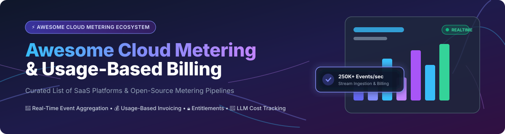

# ⚡ Awesome Cloud Metering & Usage-Based Billing Platform Ecosystem 🚀

<p align="center">
  
</p>

<p align="center">
  <a href="https://github.com/ishandutta2007/Awesome-Awesome-Awesome"></a>
  <a href="https://discord.gg/jc4xtF58Ve"></a>
  <a href="https://github.com/ishandutta2007/Awesome-Cloud-Metering-Platform"></a>
  <a href="https://github.com/ishandutta2007/Awesome-Cloud-Metering-Platform/network/members"></a>
  <a href="https://github.com/ishandutta2007"></a>
</p>

---

### 🌟 Overview & Market Context

> 📊 **Market Size & Structure**: The global cloud metering and usage-based billing market is estimated at **$9.4B to $12.8B in 2025** and projected to grow beyond **$30B–$40B by 2034–2035** (CAGR ~11%–13%). The market is **moderately to highly fragmented** (not a winner-take-all market) due to diverse infrastructure requirements across AI token billing, API monetization, telecom, and multi-tenant SaaS environments.

This curated repository tracks top **SaaS platforms** and production-ready **open-source projects** for **Cloud Metering**, **Usage Analytics**, **Entitlements**, and **Usage-Based Billing**. These developer tools help engineering and product teams ingest millions of real-time events, track AI tokens, enforce feature flags, and automate complex invoicing.

---

## 📚 Table of Contents
- [🏢 SaaS/Hosted Platforms](#-saashosted-platforms)
- [🔓 Open-Source GitHub Projects](#-open-source-github-projects)
- [🤝 How to Contribute](#-how-to-contribute)
- [📈 Star History](#-star-history)
- [💖 Support & Sponsorship](#-support--sponsorship)
- [⚠️ Disclaimer](#%EF%B8%8F-disclaimer)

---

## 🏢 SaaS/Hosted Platforms

The table below compares leading hosted cloud metering and consumption billing SaaS platforms, ordered by company size (valuation / ARR / funding scale in descending order).

| 🏢 Platform | 💰 Company Size (Valuation / Revenue / Funding) | 🏷️ Starting Pricing Tier | 🎁 Free Tier / Free Trial Limits | ⚡ Key Capabilities & Focus |
| :--- | :--- | :--- | :--- | :--- |
| **[Metronome](https://metronome.com/)** | **~$1.0B Valuation** (Acquired by Stripe in 2026 for ~$1B; ~$22.1M ARR) | **Starter**: $0 base platform fee + $0.04/1k events & 0.8% billing volume | **Free Starter Plan** with core event ingestion, Stripe sync, and embeddable dashboards | Enterprise usage-based billing engine with custom rate cards, commitments, ramps, and native Stripe integration. |
| **[Orb](https://www.orb.com/)** | **$335M Valuation** (Acquired by Adyen in 2026 for $335M; $44.1M funding) | **Growth**: Starts at ~$720/mo (custom contracts for enterprise scale) | **Developer Sandbox** with mock data testing and full API access | 250K+ events/sec ingestion, real-time SQL billable metrics, versioned price migrations, and revenue design dashboards. |
| **[CloudZero Metering](https://www.cloudzero.com/)** | **~$119M Total Funding** (~$25.4M est. annual revenue) | **Custom Quote**: Tiered pricing based on tracked cloud environment scale | **14-Day Free Trial** with cloud environment scanning and cost attribution | FinOps cloud cost intelligence and unit economics metering rather than external invoicing. |
| **[BillingPlatform](https://billingplatform.com/)** | **~$50M+ Total Funding** (Growth stage enterprise revenue manager) | **Enterprise**: Quote-based customized enterprise subscription | **14-Day Enterprise Demo/Trial** access upon sales request | Full revenue lifecycle management, usage mediation, rating engine, and ASC 606 revenue recognition. |
| **[Zenskar](https://www.zenskar.com/)** | **$21.5M Total Funding** (~$1.8M ARR growth) | **Growth**: Starts at ~$1,250/mo ($15k/yr commitment) | **14-Day Guided Free Trial** & interactive sandbox environment | Visual drag-and-drop contract builder, complex multi-tier usage metering, and billing automation. |
| **[Amberflo](https://amberflo.io/)** | **$21.0M Total Funding** (~$2.0M ARR; Series A led by AWS veterans) | **Essential**: Starts at $0 base + $0.0001 per metered event | **30-Day Free Trial** with full gateway visibility & 10k free monthly events | Real-time usage metering, cloud cost attribution by customer dimension, and hybrid pricing models. |
| **[Sequence](https://www.sequencehq.com/)** | **$5.0M+ Seed Funding** (Early-stage FinTech platform) | **Growth**: Starts at $799/month for early startups | **14-Day Free Trial** with automated billing workflows enabled | Quote-to-cash platform combining usage billing, subscription management, and embedded finance workflows. |
| **[Usage.ai](https://www.usage.ai/)** | **~$3.0M Seed Funding** (AI cost optimization provider) | **Starter**: Percentage of verified cloud savings (performance model) | **Free Cloud Audit** with unlimited spending insights & recommendations | AI-driven cloud consumption metering and cost-reduction automation for infrastructure. |

---

## 🔓 Open-Source GitHub Projects

Below is a list of top open-source cloud metering and usage-based billing projects on GitHub, sorted by Stars_Count (descending).

| 📦 Project | ⭐ GitHub_Stars | 📜 License | 🛠️ Tech Stack | 🚀 Key Features & Architectural Focus |
| :--- | :--- | :--- | :--- | :--- |
| **[Lago](https://github.com/getlago/lago)** | [](https://github.com/getlago/lago/stargazers) | AGPL-3.0 | Ruby, Go, PostgreSQL | **Most popular OS billing API** used by Mistral & Groq. Features event deduplication, 6+ metric aggregations, invoicing, and native PSP payment gateway connectors. |
| **[OpenMeter](https://github.com/openmeterio/openmeter)** | [](https://github.com/openmeterio/openmeter/stargazers) | Apache-2.0 | Go, ClickHouse, Kafka, Postgres | **High-scale AI & DevTool metering engine**. Features ClickHouse real-time aggregation, Kafka streaming, prepaid credit burndown, real-time entitlements, and LLM token cost tracking. |
| **[Lotus](https://github.com/uselotus/lotus)** | [](https://github.com/uselotus/lotus/stargazers) | MIT | Python, React, PostgreSQL | Open-source pricing and packaging infrastructure for SaaS. Provides subscription management, usage-based rate cards, customer portal, and billing experiments. |
| **[Kill Bill](https://github.com/killbill/killbill)** | [](https://github.com/killbill/killbill/stargazers) | Apache-2.0 | Java, MySQL, PostgreSQL | Enterprise-grade open-source billing and payment platform. Supports plugin architecture, usage metering, subscription lifecycle, and complex invoice processing. |
| **[Togai](https://github.com/togai-io/togai-docs)** | [](https://github.com/togai-io/togai-docs/stargazers) | Apache-2.0 | Java, Node.js | Developer-first metering and usage analytics engine. Ingests raw event streams, computes real-time aggregates, and enforces rate limits and entitlements. |
| **[Flexprice](https://github.com/flexprice/flexprice)** | [](https://github.com/flexprice/flexprice/stargazers) | Apache-2.0 | Go, PostgreSQL, ClickHouse | Composable pricing and billing infrastructure. Eliminates revenue-share fees, supports prepaid credit bundles, seat-based add-ons, and real-time usage event processing. |
| **[Meterplex](https://github.com/chitrank2050/meterplex)** | [](https://github.com/chitrank2050/meterplex/stargazers) | MIT | NestJS, Kafka 4.2, Redis 8, Postgres | Modular monolith for B2B entitlements and metering. Features Transactional Outbox Pattern for guaranteed delivery, atomic SQL upserts, and append-only audit ledgers. |
| **[Venn](https://github.com/vennbilling/venn)** | [](https://github.com/vennbilling/venn/stargazers) | AGPL-3.0 | Clojure, PostgreSQL | Lightweight self-hosted billing engine built in Clojure. Focuses on simple API interfaces and custom rating engines for software teams. |

---

## 🛠️ Architecture & Deployment Frameworks

When building a custom metering and usage-based billing infrastructure, engineering teams frequently combine these open-source building blocks:

```
┌─────────────────┐      ┌──────────────────┐      ┌─────────────────────┐
│  Usage Events   │ ───► │   Kafka / Event  │ ───► │ ClickHouse / OLAP   │
│ (APIs/AI Tokens)│      │  Streaming Bus   │      │ Real-time Aggregation│
└─────────────────┘      └──────────────────┘      └──────────┬──────────┘
                                                              │
┌─────────────────┐      ┌──────────────────┐                 │
│ Invoicing & PSP │ ◄─── │ Lago / OpenMeter │ ◄───────────────┘
│ (Stripe/Adyen)  │      │ Billing Engine   │
└─────────────────┘      └──────────────────┘
```

- **Metering Layer**: Use **OpenMeter** (ClickHouse + Kafka) for high-throughput sub-second event ingestion and LLM token accounting.
- **Billing Workflow Engine**: Use **Lago** for invoice generation, tax handling, plan packaging, and payment gateway webhooks.
- **Entitlements & Audit**: Combine with **Meterplex** for transactional outbox safety, Redis quota enforcement, and B2B contract snapshots.

---

## 🤝 How to Contribute

Contributions are warmly welcomed! To contribute:

1. 🍴 **Fork** this repository.
2. 📝 Add or update SaaS / Open-Source entries in `README.md` following the tabular format.
3. 🔗 Ensure descriptions are factual and include verifiable pricing, license, or star metrics.
4. 🚀 Submit a **Pull Request** with a brief summary of additions.

---

## 📈 Star History

[](https://star-history.dera.page/#ishandutta2007/Awesome-Cloud-Metering-Platform&type=date&legend=top-left)

---

## 💖 Support & Sponsorship

If you find this repository helpful for your engineering, SaaS, or FinOps architecture decisions:

- ⭐ **Star** this repository to increase visibility!
- 🔀 **Fork** and share it with fellow cloud infrastructure builders.
- ☕ **Buy me a coffee**: Support ongoing open-source maintenance via the [GitHub Sponsors Dashboard](https://github.com/sponsors/ishandutta2007).

---

## ⚠️ Disclaimer

- This repository is a community-curated list and does not constitute financial, legal, or software warranty advice.
- Cloud metering platforms process mission-critical usage data; always perform security, SOC2 compliance, and SLA checks before deployment.
